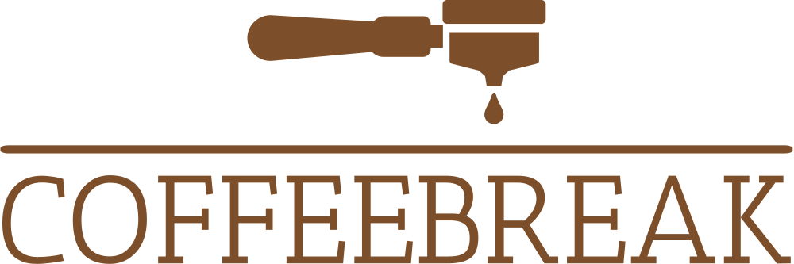

# coffee-break-bar

Stijlbreuk coffee bar assignment. Built with Vue 3, Vite, TypeScript and TailwindCSS.

<table align="center"><tr><td align="center" width="9999">
<a align="center" href="https://github.com/Dot-star-ctrl/coffee-break-bar">
    
</a>

</td></tr></table>

## Project Setup

```sh
npm install
```

### Compile and Hot-Reload for Development

```sh
npm run dev
```

### Type-Check, Compile and Minify for Production

```sh
npm run build
```

### Lint with [ESLint](https://eslint.org/)

```sh
npm run lint
```
